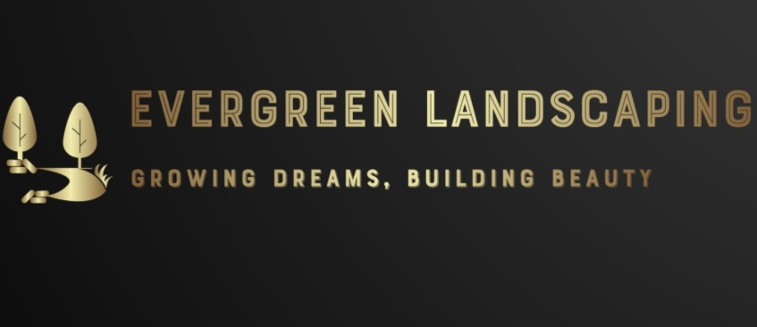

<!DOCTYPE html>
<html lang="en">
<head>
    <meta charset="UTF-8">
    <meta name="viewport" content="width=device-width, initial-scale=1.0">
    <title>Evergreen Landscaping</title>
    
</head>
<body>
    <header>
        
        Evergreen Landscaping
        <a href="tel:3175169452" class="call-now">📞 Call Now</a>
    </header>
    <nav>
        <a href="#lawn-care">Lawn Care</a>
        <a href="#mulching">Mulch Installation</a>
        <a href="#tree-removal">Tree Removal</a>
    </nav>
    
Professional Landscaping Services

    

        <h2>Lawn Care</h2>
        
Our comprehensive lawn care services include regular mowing, edging, aeration, and dethatching. We also provide fertilization programs tailored to your lawn’s specific needs and seasonal requirements, ensuring it remains green and healthy all year long.

        

            

            

            

        

    

    

        <h2>Mulch Installation</h2>
        
Our professional mulch installation service helps conserve moisture, suppress weeds, and enhance the appearance of your landscape. We use high-quality mulch materials to improve soil health and protect plant roots.

        

            

            

            

        

    

    

        <h2>Tree Removal and Land Clearance</h2>
        
We specialize in tree removal and land clearance services, ensuring your property is safe and cleared efficiently. Whether it's hazardous trees, overgrown areas, or preparing a site for new development, our professional team handles it with precision and care.

        

            

            

            

        

    

    <footer>&copy; 2025 Evergreen Landscaping. All rights reserved.</footer>
</body>
</html>

